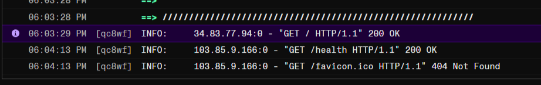

# 🧠 KnowledgeBot — AI-Powered Knowledge Assistant

A web-based AI chatbot that accepts knowledge sources (YouTube, PDF, PPTX, Webpage), processes them into vector embeddings, and answers questions grounded strictly in that content — with source citations.



## ✨ Features

- **Multi-source support** — Upload PDFs, PPTX, paste YouTube or webpage URLs
- **RAG-powered answers** — Uses vector embeddings + similarity search, not full-doc prompting
- **Source citations** — Every answer references where the info came from (page, slide, timestamp)
- **Streaming responses** — Token-by-token streaming via SSE
- **Session memory** — Follow-up questions work naturally within a session
- **Quiz mode** — Auto-generates source-aware questions based on loaded content
- **Graceful decline** — Politely refuses out-of-scope questions

## 🏗️ Tech Stack

| Layer | Technology |
|-------|-----------|
| **Frontend** | Next.js (App Router) + TypeScript + Vanilla CSS |
| **Backend** | FastAPI (Python) |
| **Database** | Supabase (PostgreSQL + pgvector) |
| **LLM (Dev)** | Ollama — qwen2.5:1.5b |
| **LLM (Prod)** | Google Gemini — gemini-2.5-flash |
| **Embeddings** | Ollama nomic-embed-text or Gemini gemini-embedding-001 (768-dim) |

## 📁 Project Structure

```
AS-1/
├── backend/
│   ├── main.py                 # FastAPI entry point
│   ├── config.py               # Environment settings
│   ├── schema.sql              # Supabase database schema
│   ├── pyproject.toml          # Python dependencies (uv)
│   ├── uv.lock                 # Lockfile
│   ├── .env.example            # Env template
│   ├── processors/
│   │   ├── pdf.py              # PDF text extraction
│   │   ├── pptx.py             # PowerPoint text extraction
│   │   ├── webpage.py          # Webpage scraping/parsing
│   │   ├── youtube.py          # YouTube transcript extraction
│   │   └── chunker.py          # Text chunking with metadata
│   ├── rag/
│   │   ├── embeddings.py       # Vector embedding generation
│   │   ├── vectorstore.py      # Supabase pgvector operations
│   │   ├── gemini.py           # Gemini API retry/error helpers
│   │   └── chat.py             # RAG chat engine
│   └── routes/
│       ├── sessions.py         # Session management API
│       ├── sources.py          # Source upload/processing API
│       ├── chat.py             # Chat API (streaming + non-streaming)
│       └── quiz.py             # Quiz generation/checking API
├── frontend/
│   ├── app/
│   │   ├── globals.css         # Design system
│   │   ├── layout.tsx          # Root layout
│   │   └── page.tsx            # Main page
│   ├── components/
│   │   ├── ChatPanel.tsx       # Chat interface
│   │   ├── MessageBubble.tsx   # Message rendering
│   │   ├── SourceUpload.tsx    # File upload + URL input
│   │   ├── SourceBadge.tsx     # Source status badges
│   │   └── QuizMode.tsx        # Source-aware quiz UI
│   └── lib/
│       └── api.ts              # Backend API client
└── README.md
```

## 🚀 Getting Started

### Prerequisites

- **Python 3.11+**
- **uv** — [Install here](https://docs.astral.sh/uv/getting-started/installation/)
- **Node.js 18+**
- **Ollama** — [Install here](https://ollama.ai)
- **Supabase account** — [Sign up free](https://supabase.com)

### 1. Clone & Setup

```bash
git clone <your-repo-url>
cd AS-1
```

### 2. Supabase Setup

1. Create a new project at [supabase.com](https://supabase.com)
2. Go to **SQL Editor** and run the contents of `backend/schema.sql`
3. Get your **Project URL** and **anon key** from Settings → API

### 3. Backend Setup

```bash
cd backend

# Install dependencies (creates .venv automatically)
uv sync

# Configure environment
cp .env.example .env
# Edit .env with your Supabase URL + Key

# Start the backend
uv run uvicorn main:app --reload --port 8000
```

### 4. LLM Setup

For local Ollama development:

```bash
ollama pull qwen2.5:1.5b
ollama pull nomic-embed-text
```

For Gemini, set these values in `backend/.env`:

```bash
LLM_PROVIDER=gemini
GEMINI_API_KEY=your-gemini-api-key
GEMINI_CHAT_MODEL=gemini-2.5-flash
GEMINI_EMBED_MODEL=gemini-embedding-001
GEMINI_EMBED_DIMENSIONS=768
```

### 5. Frontend Setup

```bash
cd frontend

# Install dependencies
npm install

# Start dev server
npm run dev
```

### 6. Open the App

Visit **http://localhost:3000** — upload a PDF and start chatting!

## 🔧 Environment Variables

| Variable | Description | Required |
|----------|-------------|----------|
| `SUPABASE_URL` | Your Supabase project URL | ✅ |
| `SUPABASE_KEY` | Supabase anon/public key | ✅ |
| `OLLAMA_BASE_URL` | Ollama server URL (default: `http://localhost:11434`) | ✅ |
| `LLM_PROVIDER` | `ollama` or `gemini` | ✅ |
| `GEMINI_API_KEY` | Google Gemini API key (production only) | ❌ |
| `GEMINI_CHAT_MODEL` | Gemini chat model (default: `gemini-2.5-flash`) | ❌ |
| `GEMINI_EMBED_MODEL` | Gemini embedding model (default: `gemini-embedding-001`) | ❌ |
| `GEMINI_EMBED_DIMENSIONS` | Embedding dimensions, keep `768` for current schema | ❌ |
| `GEMINI_MAX_RETRIES` | Retry attempts for Gemini 429/5xx responses (default: `4`) | ❌ |
| `GEMINI_RETRY_BASE_SECONDS` | Initial retry backoff in seconds (default: `2`) | ❌ |
| `GEMINI_RETRY_MAX_SECONDS` | Maximum retry delay in seconds (default: `30`) | ❌ |

## 📋 Development Phases

- [x] **Phase 1** — Foundation: PDF upload, basic RAG chat, themed UI
- [x] **Phase 2** — YouTube, PPTX, and Webpage source processors
- [x] **Phase 3** — Streaming responses + session memory
- [x] **Phase 4** — Quiz mode + UI polish
- [x] **Phase 5** — Gemini swap
- [ ] **Deployment** — Hosting setup and production hardening

## 📄 License

MIT
